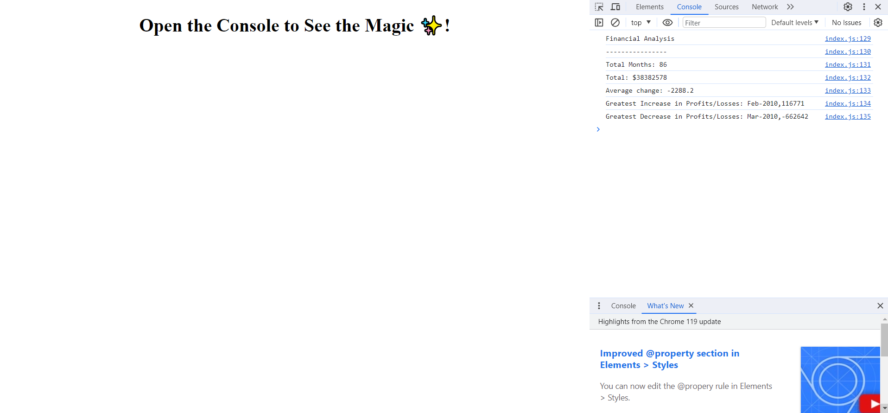

# Console Finances

## Description

This project uses JavaScript to make various calculations regarding profits and losses with given data. It is is live deployed on Git Pages. The live deployment can be viewed [here](https://tg-ivy.github.io/console-finances/). Below is an attached screenshot.

## Installation

N/A

## Credits

edX Front-End Web Development Bootcamp

## License

Refer to the LICENSE in the repo.